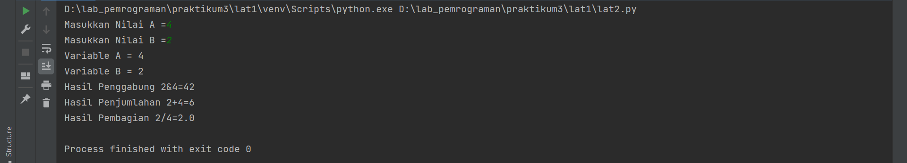
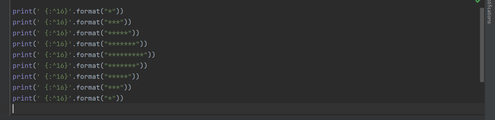
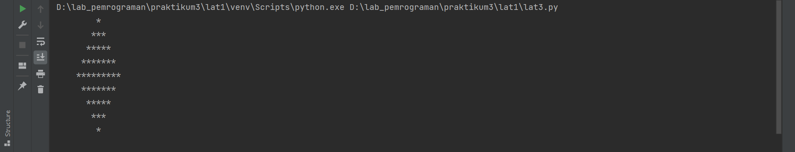
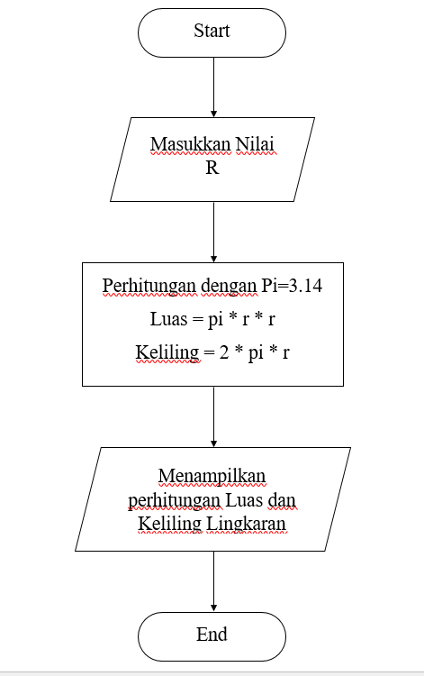
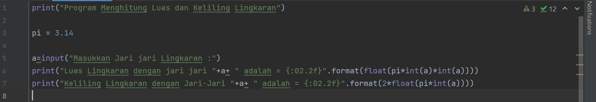
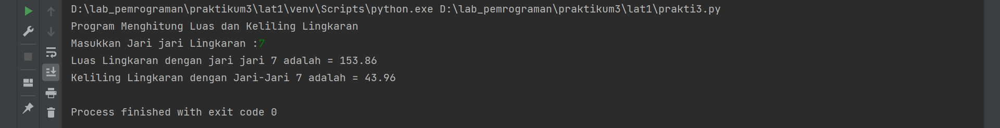

"## Praktikum 3" 

## Latihan 1

Pada latihan kali ini kita akan mempelajari penggunaan end, separator, dan string format pada bahasa pemrograman python.  
langsung saja berikut adalah contoh penggunaan end.  

gambar diatas merupakan contoh penggunaan end pada python dan untuk output yang keluar dari kode diatas adalah sebagai berikut.  

Dari gambar diatas dapat disimpulkan bahwa penggunaan end ini untuk memberi garis baru pada program yang kita  inginkan.  
Selanjutnya kita akan mempelajari separator langsung saja berikut adalah contoh penggunaan separator pada bahasa pemrograman python.  

Dari berikut adalah hasil output yang dihasilkan dari contoh separator diatas :  

dari gambar diatas dapat disimpulkan bahwa separator digunakan untuk memisahkan elemen program satu sama lain.
Selanjutnya kita akan belajar tentang string formaat pada bahasa pemrograman python.  

Hasil outputnya sebagai berikut :  

Adapun contoh yang kedua  

dan hasil outputnya.  

format disini berfungsi untuk melakukan pengaturan format string yang akan dicetak atau ditampilkan ke monitor.  

## Latihan 2

Menjumlahkan dua buah bilangan menggunakan variabel a dan b. 

a = 8  
b = 6 
print ("variable a=",a) 
print ("variable b=",b) 
print ("hasil penjumlahan a+b=",a+b) 
 
• Mendefinisikan variable a dengan nilai 8 
• Mendefinisikan variable b dengan nilai 6 
• Mencetak nilai variable a dan b 
• Mencetak hasil penjumlahan a+b 

## Latihan 3

Membuat contoh program dengan menggunakan string formating pada bahasa pemrograman python:  

Hasil Output diatas adalah :  

## Membuat Program Perhitungan Luas dan Keliling Sebuah Lingkaran

Kali ini saya ditugaskan untuk membuat sebuah program sederhana dengan memnggunakan bahasa pemrograman python bagaimana cara menghitung sebuah luas dan keliling dari sebuah lingkkaran, sebelumnya saya akan menampilkan flowchart yang sudah saya rancang :

Dan Berikut adalah source kode yang sudah saya buat :  

dan output yang dihasilkan adalah :  

Penjelasan  
Line 1 : Mencetak string dengan judul "Program Menghitung Luas dan Keliling Lingkaran"  
Line 3 : Membuat sebuah variabel yang berisikan phi yakni 3.14 untuk perhitungan nantinya  
Line 5 : Membuat inputan user dengan a sebagai variabelnya yang dimaksudkan untuk jari jari lingkaran tersebut  
Line 6 : Proses perhitungan luas lingkaran dengan jari jari a dan pi sebagai float untuk rumus luas lingkaran dan fungsi {:02.2f} adalah untuk mengambil 2 angka dibelakang koma dari hasil perhitungan  
Line 7 : Proses perhitungan Keliling lingkaran dengan jari jari a dan pi sebagai float untuk rumus luas lingkaran dan fungsi {:02.2f} adalah untuk mengambil 2 angka dibelakang koma dari hasil perhitungan  

SEKIAN DAN TERIMA KASIH :)
